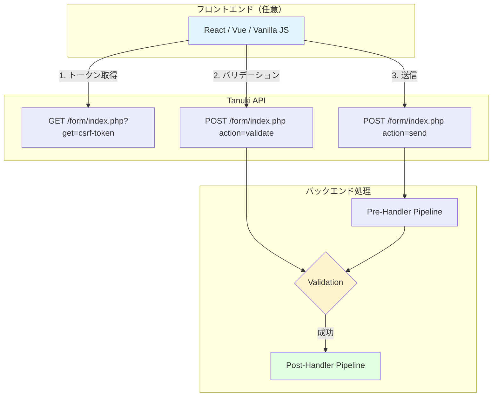
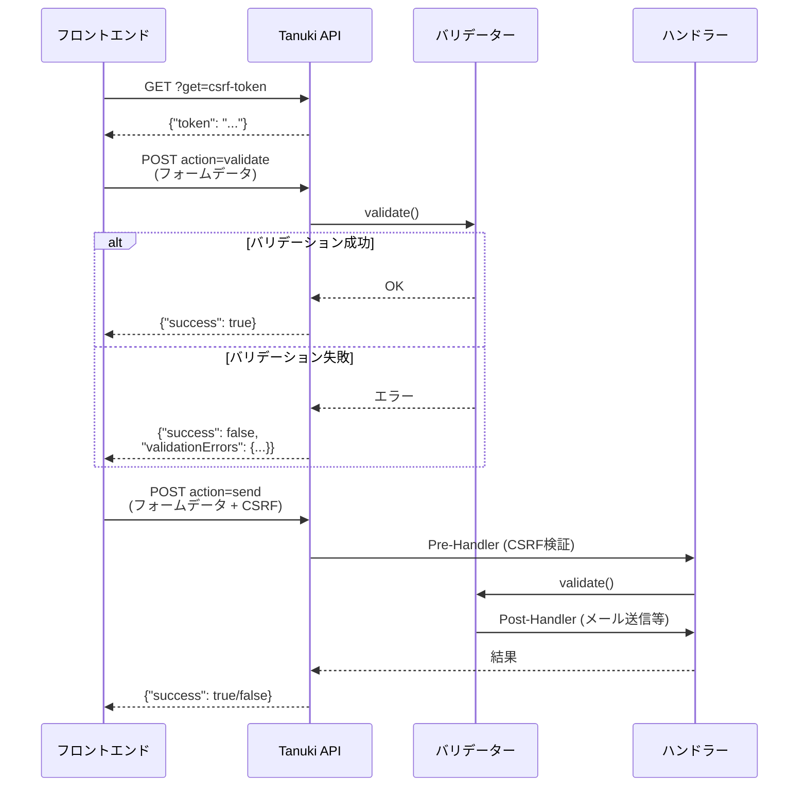
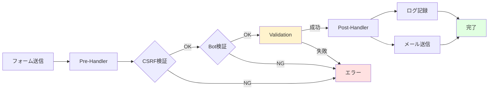

# Tanuki フレームワーク ドキュメント

Tanuki は、PHPで構築された柔軟で拡張可能なWebフォームコアライブラリです。
**ヘッドレスAPI設計**により、フロントエンドの実装に縛られず、React、Vue、vanillaJSなど、どんなフロントエンドとも組み合わせられます。

## 🎯 Tanuki の特徴

- **🔌 ヘッドレスAPI設計** - JSON APIでフロントエンドから完全に独立
- **📦 外部依存ゼロ** - PHP標準ライブラリのみで動作
- **🔄 パイプラインアーキテクチャ** - Pre → Validation → Post の明確なフロー
- **🔧 高い拡張性** - カスタムフィールド、バリデーター、ハンドラーを簡単に追加
- **🛡️ セキュリティ対応** - CSRF、reCAPTCHA、Turnstile対応
- **📝 2つのテンプレート** - ヘッドレスAPI版と従来型フォーム版を提供

## 🚀 クイックスタート

### テンプレートを使って5分で始める

Tanukiは2つの公式テンプレートを提供しています：

#### 1. ヘッドレスフォーム（推奨）

フロントエンドの自由度が高く、モダンなSPAに最適：

```bash
composer create-project tanuki-form/headless-form-skeleton my-form
cd my-form
php -S localhost:8000
```

ブラウザで `http://localhost:8000` を開くと、すぐに動作するフォームが表示されます！

**特徴:**
- JSON APIベース
- バリデーションと送信を分離可能
- React、Vue、vanilla JSなど、どんなフロントエンドとも組み合わせ可能
- フロントエンドのビルドツール不要でも動作するデモ付き

#### 2. シングルフォーム（従来型）

従来型のサーバーサイドレンダリングフォーム：

```bash
composer create-project tanuki-form/single-form-skeleton my-form
cd my-form
php -S localhost:8000
```

**特徴:**
- サーバーサイドでHTML生成
- 入力 → 確認 → 完了のステップフロー
- FormTagBinderによる自動タグ生成

## 📚 ドキュメント一覧

- **[ヘッドレスフォーム実装ガイド](HEADLESS-GUIDE.md)** - ヘッドレスAPIの詳細ガイド
- **[テンプレート比較](TEMPLATE-COMPARISON.md)** - 2つのテンプレートの違い
- **[クイックスタート](QUICKSTART.md)** - テンプレートのカスタマイズ方法
- **[実装例](examples/)** - 実際のコード例
  - [ヘッドレスフォームの実装](examples/headless-form.md)
  - [高度な使用例](examples/advanced-examples.md)
- **[APIリファレンス](api/)** - 詳細なAPI仕様
  - [コアクラス](api/core-classes.md)
  - [フィールド](api/fields.md)
  - [バリデーション](api/validation.md)
  - [ハンドラー](api/handlers.md)

## 🏗️ ヘッドレスアーキテクチャ



### ヘッドレスAPIのフロー



## 🔑 主要概念

### ヘッドレスフォームの利点

#### 従来型フォーム
```
ブラウザ → サーバー（HTML生成 + バリデーション + 処理）→ ブラウザ
```
- サーバーがHTMLを生成
- ページリロードが必要
- フロントエンド技術に制約

#### ヘッドレスフォーム
```
フロントエンド ←→ API（バリデーション + 処理）
     ↓
  自由なUI/UX
```
- フロントエンドとバックエンドが分離
- ページリロード不要
- React、Vue、Next.jsなど自由に選択可能
- ネイティブアプリからも利用可能

### API エンドポイント

| エンドポイント | メソッド | 用途 |
|---------------|---------|------|
| `?get=csrf-token` | GET | CSRFトークン取得 |
| `?get=recaptcha` | GET | reCAPTCHA Site Key取得 |
| `?get=turnstile` | GET | Turnstile Site Key取得 |
| `action=validate` | POST | バリデーションのみ実行 |
| `action=send` | POST | フォーム送信（全処理実行） |

### フィールドタイプ

| タイプ | 説明 | 用途 |
|--------|------|------|
| `value` | 単一値 | テキスト、メールアドレスなど |
| `array` | 配列値 | チェックボックス、複数選択 |
| `file` | ファイル | ファイルアップロード |
| `struct` | 構造化データ | ネストされた複雑なデータ |

### バリデーター（8種類）

```php
// フィールド定義例（schema.php）
[
  "name" => [
    "validation" => [
      "required" => true,
      "minLength" => 2,
      "maxLength" => 50
    ]
  ],
  "email" => [
    "validation" => [
      "required" => true,
      "email" => true
    ]
  ]
]
```

| バリデーター | 説明 | 使用例 |
|-------------|------|--------|
| `required` | 必須 | `"required" => true` |
| `email` | メール形式 | `"email" => true` |
| `minLength` | 最小文字数 | `"minLength" => 5` |
| `maxLength` | 最大文字数 | `"maxLength" => 100` |
| `matchField` | フィールド一致 | `"matchField" => "password"` |
| `numeric` | 数値 | `"numeric" => true` |
| `inArray` | 許可リスト | `"inArray" => ["A", "B", "C"]` |
| `pattern` | 正規表現 | `"pattern" => "^\\d{3}-\\d{4}$"` |

### ハンドラーパイプライン



## 📊 ヘッドレスフォームの実装例

### フロントエンド（Vanilla JS）

```javascript
// APIクライアント
const API = {
  baseUrl: "/form/index.php",

  async getCsrfToken() {
    const res = await fetch(`${this.baseUrl}?get=csrf-token`);
    const data = await res.json();
    return data.token;
  },

  async validate(formData) {
    formData.append("action", "validate");
    const res = await fetch(this.baseUrl, {
      method: "POST",
      body: formData
    });
    return await res.json();
  },

  async send(formData) {
    formData.append("action", "send");
    const res = await fetch(this.baseUrl, {
      method: "POST",
      body: formData
    });
    return await res.json();
  }
};

// フォーム送信
document.querySelector("form").addEventListener("submit", async (e) => {
  e.preventDefault();

  const formData = new FormData(e.target);

  // CSRFトークンを取得して追加
  const token = await API.getCsrfToken();
  formData.append("csrf-token", token);

  // 送信
  const result = await API.send(formData);

  if (result.success) {
    alert("送信成功！");
  } else {
    console.error("エラー:", result.validationErrors);
  }
});
```

### バックエンド（PHP）

```php
<?php
// form/index.php
use Tanuki\Tanuki;

require_once __DIR__ . "/../vendor/autoload.php";
require_once __DIR__ . "/functions.php";

function response($data) {
  header("Content-Type: application/json");
  echo json_encode($data);
  exit;
}

$tanuki = new Tanuki();
$form = $tanuki->createForm(getConfig("config"));

// GET: トークン取得
if ($_SERVER["REQUEST_METHOD"] === "GET") {
  switch ($_GET["get"] ?? null) {
    case "csrf-token":
      response(["token" => $form->helper->getCsrfToken()]);
    case "recaptcha":
      response(["siteKey" => $form->helper->getRecaptchaSiteKey()]);
    case "turnstile":
      response(["siteKey" => $form->helper->getTurnstileSiteKey()]);
  }
}

// POST: バリデーション/送信
$form->bind($_POST ?? []);

switch ($_POST["action"] ?? null) {
  case "validate":
    if ($form->validate()) {
      response(["success" => true]);
    } else {
      response([
        "success" => false,
        "validationErrors" => $form->getValidationErrors()
      ]);
    }

  case "send":
    $result = $form->send();
    if ($result->isSuccessful()) {
      response(["success" => true]);
    } else {
      response([
        "success" => false,
        "validationErrors" => $result->getValidationErrors()
      ]);
    }
}
```

## 🛡️ セキュリティ機能

### CSRF保護

```javascript
// フロントエンド
const token = await API.getCsrfToken();
formData.append("csrf-token", token);
```

```php
// バックエンド（config/config.php）
"preHandlers" => [
  [
    "handler" => CsrfGuardHandler::class,
    "config" => []
  ]
]
```

### reCAPTCHA v3

```javascript
// フロントエンド
const siteKey = await API.getRecaptchaSiteKey();

grecaptcha.enterprise.ready(async () => {
  const token = await grecaptcha.enterprise.execute(siteKey, {
    action: "submit"
  });
  formData.append("recaptcha-token", token);
});
```

```php
// バックエンド（config/pre-handlers/recaptcha.php）
[
  "handler" => RecaptchaHandler::class,
  "config" => [
    "projectId" => "your-project-id",
    "apiKey" => "your-api-key",
    "siteKey" => "your-site-key",
    "action" => "submit"
  ]
]
```

## 📝 メール送信機能

### 設定例

```php
// config/post-handlers/send-admin.php
use Tanuki\PostHandler\MailSenderHandler;

return [
  "handler" => MailSenderHandler::class,
  "config" => [
    "smtp" => [
      "host" => "smtp.example.com",
      "auth" => true,
      "username" => "user@example.com",
      "password" => "password",
      "secure" => "ssl",
      "port" => 587
    ],
    "from" => "noreply@example.com",
    "fromName" => "お問い合わせフォーム",
    "to" => "admin@example.com",
    "toName" => "管理者",
    "subject" => "お問い合わせを受け付けました",
    "bodyTemplate" => file_get_contents(__DIR__ . "/../email-templates/admin.txt")
  ]
];
```

### メールテンプレート（Twig形式）

```
// config/email-templates/admin.txt
お問い合わせを受け付けました。

【名前】
{{ data.name }}

【メールアドレス】
{{ data.email }}

【メッセージ】
{{ data.message }}

送信日時: {{ "now"|date("Y-m-d H:i:s") }}
```

## 🎨 フロントエンド連携

### React との連携

```jsx
import { useState } from "react";

function ContactForm() {
  const [errors, setErrors] = useState({});

  const handleSubmit = async (e) => {
    e.preventDefault();
    const formData = new FormData(e.target);

    // CSRFトークン取得
    const tokenRes = await fetch("/form/index.php?get=csrf-token");
    const { token } = await tokenRes.json();
    formData.append("csrf-token", token);

    // 送信
    formData.append("action", "send");
    const res = await fetch("/form/index.php", {
      method: "POST",
      body: formData
    });

    const result = await res.json();

    if (result.success) {
      alert("送信成功！");
    } else {
      setErrors(result.validationErrors);
    }
  };

  return (
    <form onSubmit={handleSubmit}>
      <input type="text" name="name" />
      {errors.name && <span>{errors.name.join(", ")}</span>}

      <input type="email" name="email" />
      {errors.email && <span>{errors.email.join(", ")}</span>}

      <button type="submit">送信</button>
    </form>
  );
}
```

### Vue との連携

```vue
<template>
  <form @submit.prevent="handleSubmit">
    <input v-model="form.name" type="text" name="name" />
    <span v-if="errors.name">{{ errors.name.join(", ") }}</span>

    <input v-model="form.email" type="email" name="email" />
    <span v-if="errors.email">{{ errors.email.join(", ") }}</span>

    <button type="submit">送信</button>
  </form>
</template>

<script>
export default {
  data() {
    return {
      form: { name: "", email: "" },
      errors: {}
    };
  },
  methods: {
    async handleSubmit() {
      const formData = new FormData();
      formData.append("name", this.form.name);
      formData.append("email", this.form.email);

      // CSRFトークン取得
      const tokenRes = await fetch("/form/index.php?get=csrf-token");
      const { token } = await tokenRes.json();
      formData.append("csrf-token", token);

      // 送信
      formData.append("action", "send");
      const res = await fetch("/form/index.php", {
        method: "POST",
        body: formData
      });

      const result = await res.json();

      if (result.success) {
        alert("送信成功！");
        this.errors = {};
      } else {
        this.errors = result.validationErrors;
      }
    }
  }
};
</script>
```

## 🔗 テンプレート比較

| 特徴 | ヘッドレスフォーム | シングルフォーム |
|------|------------------|----------------|
| **アーキテクチャ** | API（JSON） | サーバーサイドレンダリング |
| **フロントエンド** | 完全に自由 | PHPテンプレート |
| **リロード** | 不要 | 必要 |
| **SPA対応** | ✅ 最適 | ❌ 不向き |
| **学習コスト** | 中 | 低 |
| **カスタマイズ性** | 高 | 中 |
| **推奨用途** | モダンなWebアプリ | 従来型フォーム |

## 📄 ライセンス

MIT License - 詳細は [LICENSE](../LICENSE) を参照してください。

## 🤝 コントリビューション

Issue、Pull Requestを歓迎します！

---

**次のステップ:**
1. [ヘッドレスフォーム実装ガイド](HEADLESS-GUIDE.md)でAPIの詳細を学ぶ
2. [テンプレート比較](TEMPLATE-COMPARISON.md)で最適な選択をする
3. [クイックスタート](QUICKSTART.md)でテンプレートをカスタマイズ
4. [APIリファレンス](api/)で詳細仕様を確認
